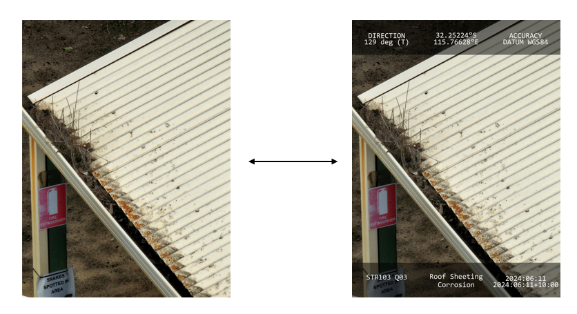

## Tool Description

This tool reads the EXIF metadata from an image and creates an overlay on top of it with custom fields. It also scans a folder with multiple images and creates an Excel file with the following columns:

- `image_path`
- `glocation`
- `component`
- `defect_line1`
- `defect_line2`
- `idd`
- `rotation`

The user then inputs the `glocation`, `component`, and other fields, and the overlay is applied to all images listed in the Excel file.



## Usage Instructions

1. **Define Picture Directory**
    ```python
    directory = r"test"
    ```

2. **Define a Path to Create an Excel File with All Image File Paths and Template**
    ```python
    excel_path = r"data\defects.xlsx"
    ```

3. **Run scan_and_write_excel to Create an Excel File to Input the Text Fields**
    ```python
    scan_and_write_excel(directory, excel_path)
    ```

4. **Fill the Excel with `image_path`, `glocation`, `component`, `defect_line1`, `defect_line2`, `idd`, and `rotation`**

5. **Run the Following to Process Images and Apply Overlays**
    ```python
    process_images_from_excel_with_rotation(excel_path, output_folder=r"results")
    ```

6. **Check the `results` Folder for the New Images with Applied Overlays**
